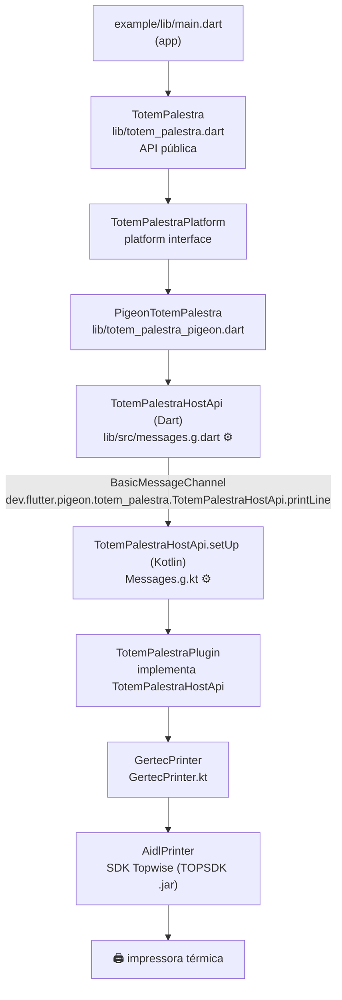
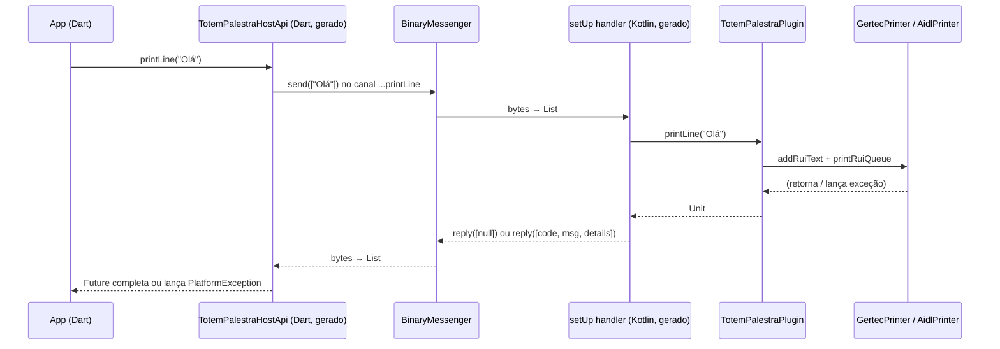

# totem_palestra

Plugin Flutter de demonstração para uma palestra sobre **comunicação entre Flutter e código nativo**.

O plugin faz uma coisa só: **imprime uma linha de texto na impressora térmica de um totem Gertec SK-210**, que usa o SDK Topwise. O objetivo não é a impressão em si. É mostrar, com um caso real, como sair de um `MethodChannel` escrito à mão para uma API **gerada e tipada com o [Pigeon](https://pub.dev/packages/pigeon)**.

---

## Sumário

1. [O que tem neste projeto](#1-o-que-tem-neste-projeto)
2. [Comunicação com o nativo: o básico](#2-comunicação-com-o-nativo-o-básico)
3. [O jeito clássico: MethodChannel escrito à mão](#3-o-jeito-clássico-methodchannel-escrito-à-mão)
4. [O que é o Pigeon](#4-o-que-é-o-pigeon)
5. [Arquitetura deste plugin](#5-arquitetura-deste-plugin)
6. [Passo a passo: como a migração foi feita](#6-passo-a-passo-como-a-migração-foi-feita)
7. [Por baixo dos panos: o que trafega no canal](#7-por-baixo-dos-panos-o-que-trafega-no-canal)
8. [Tratamento de erros](#8-tratamento-de-erros)
9. [Tipos suportados: Dart ↔ Kotlin](#9-tipos-suportados-dart--kotlin)
10. [Recursos além do básico](#10-recursos-além-do-básico)
11. [Receita: adicionando um método novo](#11-receita-adicionando-um-método-novo)
12. [MethodChannel x Pigeon](#12-methodchannel-x-pigeon)
13. [Quando usar e quando não usar Pigeon](#13-quando-usar-e-quando-não-usar-pigeon)
14. [Como rodar](#14-como-rodar)
15. [Solução de problemas](#15-solução-de-problemas)
16. [Roteiro sugerido para a demo](#16-roteiro-sugerido-para-a-demo)
17. [Referências](#17-referências)

---

## 1. O que tem neste projeto

| O quê | Onde |
|---|---|
| Contrato Pigeon (a "fonte da verdade" da API) | [`pigeons/messages.dart`](pigeons/messages.dart) |
| Código Dart **gerado** | [`lib/src/messages.g.dart`](lib/src/messages.g.dart) |
| Código Kotlin **gerado** | [`android/src/main/kotlin/com/example/totem_palestra/Messages.g.kt`](android/src/main/kotlin/com/example/totem_palestra/Messages.g.kt) |
| Plugin Android (implementa a interface gerada) | [`TotemPalestraPlugin.kt`](android/src/main/kotlin/com/example/totem_palestra/TotemPalestraPlugin.kt) |
| Acesso à impressora via SDK Topwise | [`GertecPrinter.kt`](android/src/main/kotlin/com/example/totem_palestra/GertecPrinter.kt) |
| API pública do plugin | [`lib/totem_palestra.dart`](lib/totem_palestra.dart) |
| App de exemplo (campo de texto + botão "Print line") | [`example/lib/main.dart`](example/lib/main.dart) |

A API pública tem só dois métodos:

```dart
final totem = TotemPalestra();

await totem.getPlatformVersion(); // "Android 11"
await totem.printLine('Olá, palestra!'); // imprime a linha no totem
```

---

## 2. Comunicação com o nativo: o básico

O Flutter roda o seu código Dart num isolate próprio, **fora** do mundo Java/Kotlin (Android) e Swift/Obj-C (iOS). Para falar com o nativo existem os **platform channels**:

```
Dart  ──(bytes)──►  BinaryMessenger  ──(bytes)──►  Kotlin
Dart  ◄──(bytes)──  BinaryMessenger  ◄──(bytes)──  Kotlin
```

- **`BinaryMessenger`**: o "cano". Ele só transporta `ByteBuffer`s identificados por um **nome de canal** (uma string).
- **Codec**: transforma valores em bytes e de volta. O padrão é o `StandardMessageCodec`, que sabe serializar `null`, `bool`, `int`, `double`, `String`, listas tipadas (`Uint8List`...), `List` e `Map`.
- **Tudo é assíncrono.** Do lado Dart você sempre recebe um `Future`.
- **Thread:** por padrão, os handlers nativos rodam na **main thread** do Android. Trabalho pesado ali trava a UI nativa.

Existem três "sabores" de canal, todos em cima do mesmo `BinaryMessenger`:

| Canal | Para quê | Formato |
|---|---|---|
| `MethodChannel` | Chamar um "método" pelo nome, com argumentos | `MethodCall(nome, argumentos)` → resultado ou erro |
| `EventChannel` | Stream contínuo do nativo para o Dart | eventos + erro + fim |
| `BasicMessageChannel` | Mandar uma mensagem qualquer e receber uma resposta | valor → valor |

> **O Pigeon usa `BasicMessageChannel` por baixo**, um canal por método. Ele não inventa um transporte novo: só gera o código chato e perigoso por você.

---

## 3. O jeito clássico: MethodChannel escrito à mão

Este projeto nasceu do template `flutter create -t plugin`, que usa `MethodChannel`:

```dart
// Dart
final methodChannel = const MethodChannel('totem_palestra');

Future<String?> getPlatformVersion() async {
  return methodChannel.invokeMethod<String>('getPlatformVersion');
}
```

```kotlin
// Kotlin
override fun onMethodCall(call: MethodCall, result: Result) {
  if (call.method == "getPlatformVersion") {
    result.success("Android ${android.os.Build.VERSION.RELEASE}")
  } else {
    result.notImplemented()
  }
}
```

Com um método, funciona. O problema aparece quando a API cresce. O código de impressão foi portado de um plugin anterior (projeto `gertec`, em Java com `MethodChannel`), e ele mostra bem os riscos:

```java
// GertecPrinterPlugin.java (projeto original)
case "PRINT_QRCODE":
    int widthQR = call.argument("width");       // unboxing: NullPointerException se faltar
    int heightQR = call.argument("height");
    String textQrcode = call.argument("text");
    ...

// GertecPrinter.java (projeto original)
int fontSize = map.get("fontSize") != null ? (int) map.get("fontSize") : PrinterConstant.FontSize.NORMAL;
boolean bold = map.get("bold") != null ? (boolean) map.get("bold") : false;
```

Problemas encontrados nesse código (bugs de 1 a 5, riscos latentes em 6 e 7), **todos do tipo que o compilador não pega**:

| # | Problema | Consequência |
|---|---|---|
| 1 | `switch` com `default: result.notImplemented();` **sem `break`**, no topo | Um método desconhecido cai no `case "START_TRANSACTION"` e responde **duas vezes** (`Reply already submitted`) |
| 2 | `catch (NullPointerException e)` que só faz `Log.d` | O `Future` do Dart **nunca completa** e o app fica esperando para sempre |
| 3 | `PRINT_TEXT` devolve `success: true` no `catch` de erro | O Dart acha que imprimiu quando falhou |
| 4 | `PrinterState.PRINT_ERROR_PARAMETER` é **255** no SDK, mas o enum Dart assume **12** | `PrinterState.values.where(...).first` lança `StateError` |
| 5 | Resposta é um JSON (Gson) **dentro de uma String**, e o Dart faz `json.decode` + `content as dynamic` | Serialização dupla e casts sem garantia nenhuma |
| 6 | Nomes de método e chaves de mapa são strings repetidas nos dois lados (`"PRINT_TEXT"`, `"fontSize"`, `"args"`...) | Um erro de digitação vira `null` silencioso ou `notImplemented` em produção |
| 7 | `call.argument<Int>(...)`: o Dart manda inteiros pequenos como int32 e grandes como int64 | O mesmo argumento chega às vezes como `Int` e às vezes como `Long` (`ClassCastException`) |

Nada disso é "culpa" do `MethodChannel`: ele é um transporte genérico. O problema é que o **contrato** entre Dart e nativo só existe na cabeça de quem escreveu, espalhado em strings dos dois lados.

---

## 4. O que é o Pigeon

**Pigeon é um gerador de código.** Você escreve o **contrato** da API em Dart puro (classes abstratas, sem implementação) e ele gera:

- o **cliente Dart** que você chama no app;
- a **interface nativa** que você implementa;
- toda a serialização, os nomes de canal e o tratamento de erro no meio.

Linguagens geradas: **Kotlin e Java** (Android), **Swift e Objective-C** (iOS/macOS), **C++** (Windows) e **GObject** (Linux).

```
             pigeons/messages.dart   ← você escreve (contrato)
                      │
            dart run pigeon
                      │
        ┌─────────────┴──────────────┐
        ▼                            ▼
lib/src/messages.g.dart     android/.../Messages.g.kt   ← gerados (não edite)
        │                            │
  você chama                   você implementa
```

### O que ele resolve

- **Contrato único e tipado**: renomeou um parâmetro? Os dois lados deixam de compilar até você corrigir.
- **Sem strings mágicas**: nomes de canal e de método são gerados.
- **Serialização gerada**: data classes, enums, listas e mapas tipados, sem `toMap`/`fromMap`.
- **Nulabilidade respeitada**: `String` não-nulo no contrato vira `String` não-nulo no Kotlin.
- **Erros padronizados**: exceções no nativo viram `PlatformException` no Dart, sempre com resposta.
- **Testabilidade**: a interface gerada é fácil de trocar por um fake nos testes.

### O que ele **não** faz

- **Não deixa mais rápido de forma relevante.** O transporte é o mesmo (`BinaryMessenger` + `StandardMessageCodec`). Se o gargalo é performance (imagens grandes, milhares de chamadas por segundo), olhe para **FFI** / **jnigen**.
- **Não é para API pública.** A própria documentação do Pigeon desaconselha expor os tipos gerados para quem usa o seu plugin, porque o código gerado muda bastante entre versões. Por isso este projeto tem uma fachada (`TotemPalestra`) na frente.
- **Não deve ser dividido entre pacotes.** O Dart e o nativo precisam ser gerados **com a mesma versão do Pigeon**, no mesmo pacote.

---

## 5. Arquitetura deste plugin



⚙️ = gerado pelo Pigeon. Todo o resto é escrito à mão.

### Estrutura de arquivos

```
totem_palestra/
├── pigeons/
│   └── messages.dart                  ✍️ contrato Pigeon (entrada do gerador)
├── lib/
│   ├── totem_palestra.dart            ✍️ fachada pública (o que o app usa)
│   ├── totem_palestra_platform_interface.dart  ✍️ contrato "federado" (PlatformInterface)
│   ├── totem_palestra_pigeon.dart     ✍️ implementação que usa a API gerada
│   └── src/
│       └── messages.g.dart            ⚙️ GERADO: não edite
├── android/
│   ├── build.gradle                   ✍️ inclui android/libs/*.jar
│   ├── libs/
│   │   └── TOPSDK_V1.7.5_20231108.jar 📦 SDK Topwise (fornecido pela Gertec)
│   └── src/
│       ├── main/kotlin/com/example/totem_palestra/
│       │   ├── Messages.g.kt          ⚙️ GERADO: não edite
│       │   ├── TotemPalestraPlugin.kt ✍️ registra o handler e implementa a interface
│       │   └── GertecPrinter.kt       ✍️ fala com o SDK da impressora
│       └── test/kotlin/.../TotemPalestraPluginTest.kt  ✍️ teste unitário Kotlin
├── test/
│   ├── totem_palestra_test.dart       ✍️ testa a fachada com um platform fake
│   └── totem_palestra_pigeon_test.dart ✍️ testa a implementação com uma HostApi fake
└── example/                           app de demonstração
```

### Por que tantas camadas para dois métodos?

| Camada | Responsabilidade | Por que existe |
|---|---|---|
| `TotemPalestra` | API pública estável | Quem usa o plugin nunca vê tipo gerado. Dá para trocar Pigeon por outra coisa sem quebrar ninguém |
| `TotemPalestraPlatform` | Contrato entre plataformas | Padrão oficial de plugins (`plugin_platform_interface`). Permite mock nos testes e implementações por plataforma |
| `PigeonTotemPalestra` | Adaptador | Liga o contrato à API gerada. Recebe a `TotemPalestraHostApi` no construtor para testes |
| `TotemPalestraHostApi` (gerada) | Transporte | Serializa, manda pelo canal e trata a resposta |

Num app (não plugin), dá para chamar a API gerada direto e pular as três primeiras camadas.

---

## 6. Passo a passo: como a migração foi feita

### 6.1 `pubspec.yaml`: dependência e registro da plataforma

```yaml
dev_dependencies:
  pigeon: ^27.3.0   # dev_dependency: só roda na sua máquina, não vai para o app

flutter:
  plugin:
    platforms:
      android:
        package: com.example.totem_palestra
        pluginClass: TotemPalestraPlugin
```

> ⚠️ **Bug que existia antes do Pigeon:** o template tinha `some_platform: pluginClass: somePluginClass`. Com isso o Flutter **nunca registrava** o `TotemPalestraPlugin` no `GeneratedPluginRegistrant`, e toda chamada falhava com `MissingPluginException`. Com ou sem Pigeon, o bloco `platforms` precisa apontar para a classe certa.

Para adicionar a dependência:

```sh
dart pub add --dev pigeon
```

### 6.2 O contrato: `pigeons/messages.dart`

```dart
import 'package:pigeon/pigeon.dart';

@ConfigurePigeon(
  PigeonOptions(
    dartOut: 'lib/src/messages.g.dart',
    dartOptions: DartOptions(),
    kotlinOut:
        'android/src/main/kotlin/com/example/totem_palestra/Messages.g.kt',
    kotlinOptions: KotlinOptions(package: 'com.example.totem_palestra'),
    dartPackageName: 'totem_palestra',
  ),
)
@HostApi()
abstract class TotemPalestraHostApi {
  String getPlatformVersion();

  void printLine(String text);
}
```

O que cada parte faz:

| Trecho | Significado |
|---|---|
| `@ConfigurePigeon(...)` | Configuração dentro do próprio arquivo, então não precisa passar flags na linha de comando |
| `dartOut` | Onde gerar o Dart. Fica em `lib/src/` para **não** fazer parte da API pública |
| `kotlinOut` | Onde gerar o Kotlin. No plugin é dentro de `android/src/main/kotlin/<pacote>/` |
| `KotlinOptions(package: ...)` | O `package` do arquivo Kotlin gerado. Tem que bater com o pacote do plugin |
| `dartPackageName` | Entra no nome dos canais (`dev.flutter.pigeon.totem_palestra...`) e evita colisão com outros plugins |
| `@HostApi()` | "Esta API é implementada no **host** (nativo) e chamada pelo Dart" |
| `abstract class` | Só **declarações**. O arquivo de contrato não pode ter implementação |
| `String getPlatformVersion()` | Retorno síncrono no nativo. No Dart vira `Future<String>` |
| `void printLine(String text)` | Sem retorno. No Dart vira `Future<void>` (que completa quando o nativo termina ou falha) |

> O arquivo de contrato fica **fora de `lib/`**, porque ele não é compilado no app. Ele só serve de entrada para o gerador.

### 6.3 Gerar o código

```sh
dart run pigeon --input pigeons/messages.dart
```

Isso escreve os dois arquivos `.g`. **Rode de novo toda vez que mudar o contrato** e versione os arquivos gerados no git. Assim quem clona o projeto não precisa rodar o gerador para compilar.

### 6.4 Um tour pelo código gerado

**Dart (`lib/src/messages.g.dart`)**: uma classe concreta com um método por declaração:

```dart
Future<void> printLine(String text) async {
  final pigeonVar_channelName =
      'dev.flutter.pigeon.totem_palestra.TotemPalestraHostApi.printLine$pigeonVar_messageChannelSuffix';
  final pigeonVar_channel = BasicMessageChannel<Object?>(
    pigeonVar_channelName,
    pigeonChannelCodec,
    binaryMessenger: pigeonVar_binaryMessenger,
  );
  final Future<Object?> pigeonVar_sendFuture = pigeonVar_channel.send(<Object?>[text]);
  final pigeonVar_replyList = await pigeonVar_sendFuture as List<Object?>?;

  _extractReplyValueOrThrow(pigeonVar_replyList, pigeonVar_channelName, isNullValid: true);
}
```

**Kotlin (`Messages.g.kt`)**: uma **interface** para você implementar e um `setUp` que registra os handlers:

```kotlin
interface TotemPalestraHostApi {
  fun getPlatformVersion(): String
  fun printLine(text: String)

  companion object {
    fun setUp(binaryMessenger: BinaryMessenger, api: TotemPalestraHostApi?, messageChannelSuffix: String = "") {
      // ...
      val channel = BasicMessageChannel<Any?>(binaryMessenger,
          "dev.flutter.pigeon.totem_palestra.TotemPalestraHostApi.printLine$separatedMessageChannelSuffix", codec)
      if (api != null) {
        channel.setMessageHandler { message, reply ->
          val args = message as List<Any?>
          val textArg = args[0] as String
          val wrapped: List<Any?> = try {
            api.printLine(textArg)
            listOf(null)
          } catch (exception: Throwable) {
            MessagesPigeonUtils.wrapError(exception)
          }
          reply.reply(wrapped)
        }
      } else {
        channel.setMessageHandler(null)
      }
    }
  }
}
```

Repare no que você **não** precisa mais escrever:
- o `switch` por nome de método;
- o cast de cada argumento;
- o `try/catch` que garante **exatamente uma resposta**, inclusive em caso de exceção;
- o `notImplemented()`.

### 6.5 Implementar o lado nativo

```kotlin
class TotemPalestraPlugin: FlutterPlugin, TotemPalestraHostApi {
  override fun onAttachedToEngine(flutterPluginBinding: FlutterPlugin.FlutterPluginBinding) {
    TotemPalestraHostApi.setUp(flutterPluginBinding.binaryMessenger, this)
  }

  override fun getPlatformVersion(): String {
    return "Android ${android.os.Build.VERSION.RELEASE}"
  }

  override fun printLine(text: String) {
    GertecPrinter.printLine(text)
  }

  override fun onDetachedFromEngine(binding: FlutterPlugin.FlutterPluginBinding) {
    TotemPalestraHostApi.setUp(binding.binaryMessenger, null)
  }
}
```

- `setUp(messenger, this)` registra um handler por método. `setUp(messenger, null)` remove todos.
- Se você esquecer de implementar um método do contrato, **o Kotlin não compila**. Essa é a principal vantagem.

A parte específica do hardware fica isolada em [`GertecPrinter.kt`](android/src/main/kotlin/com/example/totem_palestra/GertecPrinter.kt):

```kotlin
fun printLine(text: String) {
  val printer = printer ?: connect().also { printer = it }
  printer.addRuiText(listOf(PrintItemObj(text)))
  printer.printRuiQueue(listener)
}
```

- `connect()` obtém o serviço `topwise_cloudpos_device_service` do sistema (via `android.os.ServiceManager`, por reflexão, do mesmo jeito que o plugin original fazia) e pega o `AidlPrinter` dele.
- Se o serviço não existir (emulador, celular comum), ele lança `FlutterError("printer-unavailable", ...)`, que chega no Dart como `PlatformException`.
- `PrintItemObj(text)` usa os padrões do SDK: fonte `NORMAL`, alinhado à esquerda, `lineHeight` 29.

> Das 460 linhas do `DeviceServiceManager.java` original (que expunha buzzer, LED, pinpad, EMV...), só foi portado o necessário para imprimir: cerca de 40 linhas em Kotlin.

### 6.6 A camada Dart

```dart
// lib/totem_palestra_pigeon.dart
class PigeonTotemPalestra extends TotemPalestraPlatform {
  PigeonTotemPalestra({@visibleForTesting TotemPalestraHostApi? api})
      : _api = api ?? TotemPalestraHostApi();

  final TotemPalestraHostApi _api;

  @override
  Future<String?> getPlatformVersion() => _api.getPlatformVersion();

  @override
  Future<void> printLine(String text) => _api.printLine(text);
}
```

- `TotemPalestraPlatform._instance` passou a ser `PigeonTotemPalestra()` por padrão.
- A API gerada é **injetável** pelo construtor, e é isso que torna o teste trivial.

### 6.7 Testes

**Dart, na implementação** ([`test/totem_palestra_pigeon_test.dart`](test/totem_palestra_pigeon_test.dart)). A API gerada é uma classe comum, então basta estender e sobrescrever:

```dart
class FakeTotemPalestraHostApi extends TotemPalestraHostApi {
  final printedLines = <String>[];

  @override
  Future<String> getPlatformVersion() async => '42';

  @override
  Future<void> printLine(String text) async => printedLines.add(text);
}

test('printLine', () async {
  final api = FakeTotemPalestraHostApi();
  await PigeonTotemPalestra(api: api).printLine('Hello');
  expect(api.printedLines, ['Hello']);
});
```

Antes era preciso interceptar o canal por nome com `setMockMethodCallHandler(MethodChannel('totem_palestra'), ...)`, e um nome errado passava despercebido.

**Kotlin** ([`TotemPalestraPluginTest.kt`](android/src/test/kotlin/com/example/totem_palestra/TotemPalestraPluginTest.kt)). Como o plugin implementa uma interface comum, o teste chama o método direto, sem Mockito, `MethodCall` nem `Result`:

```kotlin
@Test
fun getPlatformVersion_returnsExpectedValue() {
  val plugin = TotemPalestraPlugin()
  assertEquals("Android " + android.os.Build.VERSION.RELEASE, plugin.getPlatformVersion())
}
```

**Integração** ([`example/integration_test/plugin_integration_test.dart`](example/integration_test/plugin_integration_test.dart)): roda no aparelho e passa pelo canal de verdade.

---

## 7. Por baixo dos panos: o que trafega no canal

### Um canal por método

| Método | Nome do canal |
|---|---|
| `getPlatformVersion` | `dev.flutter.pigeon.totem_palestra.TotemPalestraHostApi.getPlatformVersion` |
| `printLine` | `dev.flutter.pigeon.totem_palestra.TotemPalestraHostApi.printLine` |

Formato: `dev.flutter.pigeon.<dartPackageName>.<NomeDaApi>.<método>[.<sufixo>]`.

### O envelope das mensagens

| Direção | Conteúdo |
|---|---|
| Dart → nativo | `List` com os argumentos na ordem: `["Olá, palestra!"]` (ou `null` se não há argumentos) |
| Nativo → Dart, sucesso | `List` com 1 elemento: `[resultado]` (`[null]` para `void`) |
| Nativo → Dart, erro | `List` com 3 elementos: `[código, mensagem, detalhes]` |
| Ninguém respondeu | `null`, e o Dart lança `PlatformException(code: 'channel-error')` |

### Sequência de um `printLine`



### Detalhe que pega muita gente: `int` do Dart vira `Long` no Kotlin

O codec gerado pelo Pigeon (`_PigeonCodec`) **sempre** escreve inteiros como int64:

```dart
if (value is int) {
  buffer.putUint8(4);      // tipo 4 = int64
  buffer.putInt64(value);
}
```

Então, no contrato, `int` é **sempre** `Long` no Kotlin. No `MethodChannel` puro, o `StandardMessageCodec` escreve como int32 os valores que cabem em 32 bits e como int64 os que não cabem. O mesmo argumento pode chegar como `Int` ou como `Long` dependendo do **valor**, e é exatamente daí que saem os `ClassCastException` "aleatórios" (bug 7 da tabela da seção 3).

---

## 8. Tratamento de erros

O handler gerado envolve toda chamada em `try/catch` e converte a exceção em resposta de erro:

| Lançado no Kotlin | `PlatformException` no Dart |
|---|---|
| `FlutterError(code, message, details)` | `code`, `message` e `details` exatamente como você passou |
| Qualquer outra exceção (ex.: `RemoteException`) | `code` = nome da classe (`"RemoteException"`), `message` = `exception.toString()`, `details` = causa + stacktrace |
| (nenhum handler registrado) | `code: 'channel-error'`, `"Unable to establish connection on channel: ..."` |
| Nativo devolveu `null` num retorno não-nulo | `code: 'null-error'` |

Códigos usados neste plugin:

| Código | Quando |
|---|---|
| `printer-unavailable` | O serviço Topwise não existe no aparelho (emulador, celular comum) |
| `channel-error` | Plugin não registrado (veja a [seção 15](#15-solução-de-problemas)) |

No app:

```dart
try {
  await totem.printLine(texto);
} on PlatformException catch (e) {
  // e.code == 'printer-unavailable', por exemplo
}
```

> Em métodos `@async` (seção 10) **não existe** captura automática: você é responsável por chamar o `callback` com `Result.failure(...)`.

---

## 9. Tipos suportados: Dart ↔ Kotlin

| No contrato (Dart) | Kotlin gerado | Observação |
|---|---|---|
| `bool` | `Boolean` | |
| `int` | `Long` | **Sempre** `Long` (veja a seção 7). Converta com `.toInt()` para APIs Android |
| `double` | `Double` | |
| `String` | `String` | |
| `Uint8List` | `ByteArray` | Ideal para imagens e bytes ESC/POS |
| `Int32List` / `Int64List` / `Float64List` | `IntArray` / `LongArray` / `DoubleArray` | |
| `List<T>` | `List<T>` | Genérico tipado |
| `Map<K, V>` | `Map<K, V>` | Genérico tipado |
| `enum Foo { a, b }` | `enum class Foo(val raw: Int) { A(0), B(1) }` | Nomes em `UPPER_SNAKE_CASE` no Kotlin |
| `class Foo { String x; }` | `data class Foo(val x: String)` | Gera a serialização automaticamente |
| `T?` | `T?` | A nulabilidade é respeitada dos dois lados |
| `sealed class` vazia + subclasses | `sealed class` | Herança básica (Dart, Kotlin, Swift) |

Constantes de nível superior (`const int x = 1;`) também são geradas, mas só para `String`, `int`, `double` e `bool`.

---

## 10. Recursos além do básico

Nada disso está implementado aqui (o escopo da palestra é uma linha só), mas são os próximos passos naturais para um totem.

### `@async`: esperar o nativo terminar de verdade

Hoje `printLine` retorna assim que a linha entra na fila da impressora. Para o `Future` só completar quando o papel sair:

```dart
@HostApi()
abstract class TotemPalestraHostApi {
  @async
  void printLine(String text);
}
```

O Kotlin passa a receber um `callback`:

```kotlin
private val mainHandler = Handler(Looper.getMainLooper())

override fun printLine(text: String, callback: (Result<Unit>) -> Unit) {
  GertecPrinter.printLine(text, object : AidlPrinterListener.Stub() {
    override fun onPrintFinish() {
      mainHandler.post { callback(Result.success(Unit)) }
    }

    override fun onError(code: Int) {
      mainHandler.post { callback(Result.failure(FlutterError("print-error", "Printer error $code", code))) }
    }
  })
}
```

> O listener do SDK roda numa thread do Binder. Devolver a resposta na main thread (`mainHandler.post`) segue a recomendação do Flutter para platform channels.

### `@FlutterApi`: o nativo chamando o Dart

Por exemplo, avisar o app que o papel acabou:

```dart
@FlutterApi()
abstract class PrinterEventsApi {
  void onPaperOut();
}
```

```dart
// Dart: você implementa
class _Handler implements PrinterEventsApi {
  @override
  void onPaperOut() => print('Sem papel!');
}

PrinterEventsApi.setUp(_Handler());
```

```kotlin
// Kotlin: você chama
val events = PrinterEventsApi(binding.binaryMessenger)
events.onPaperOut { result -> /* Result<Unit> */ }
```

### `@EventChannelApi`: streams tipados

Por exemplo, o estado da impressora em tempo real:

```dart
@EventChannelApi()
abstract class PrinterStreams {
  int printerState(); // vira Stream<int> no Dart
}
```

```kotlin
class PrinterStateListener : PrinterStateStreamHandler() {
  private var sink: PigeonEventSink<Long>? = null

  override fun onListen(p0: Any?, sink: PigeonEventSink<Long>) {
    this.sink = sink
  }

  fun emit(state: Int) = sink?.success(state.toLong())
}

PrinterStateStreamHandler.register(binding.binaryMessenger, PrinterStateListener())
```

### `@TaskQueue`: tirar o trabalho da main thread

```dart
@HostApi()
abstract class TotemPalestraHostApi {
  @TaskQueue(type: TaskQueueType.serialBackgroundThread)
  void printLine(String text);
}
```

O handler passa a rodar numa thread de background serial, em vez da main thread do Android.

### Sufixo de canal: várias instâncias

```dart
final impressoraA = TotemPalestraHostApi(messageChannelSuffix: 'a');
final impressoraB = TotemPalestraHostApi(messageChannelSuffix: 'b');
```

```kotlin
TotemPalestraHostApi.setUp(messenger, printerA, "a")
TotemPalestraHostApi.setUp(messenger, printerB, "b")
```

### `@ProxyApi`

Gera wrappers Dart para **classes nativas inteiras**, com ciclo de vida e instâncias. É o que plugins como `webview_flutter` e `camera` usam internamente. É avançado e está fora do escopo daqui.

---

## 11. Receita: adicionando um método novo

Exemplo: `feedPaper(int lines)`, para avançar o papel e a linha sair de baixo da guilhotina.

**1. Contrato** (`pigeons/messages.dart`):

```dart
@HostApi()
abstract class TotemPalestraHostApi {
  String getPlatformVersion();

  void printLine(String text);

  void feedPaper(int lines);
}
```

**2. Gerar:**

```sh
dart run pigeon --input pigeons/messages.dart
```

**3. Compilar e deixar o compilador guiar.** O build do Kotlin agora falha, dizendo que `TotemPalestraPlugin` não implementa o membro abstrato `feedPaper` da interface `TotemPalestraHostApi`.

**4. Implementar no Kotlin.** Lembre que `int` vira `Long`:

```kotlin
override fun feedPaper(lines: Long) {
  GertecPrinter.feedPaper(lines.toInt())
}
```

```kotlin
// GertecPrinter.kt
fun feedPaper(lines: Int) {
  val printer = printer ?: connect().also { printer = it }
  printer.addRuiText(List(lines) { PrintItemObj("") })
  printer.printRuiQueue(listener)
}
```

**5. Expor no Dart:** `TotemPalestraPlatform` (declaração), `PigeonTotemPalestra` (`_api.feedPaper(lines)`) e `TotemPalestra` (fachada).

**6. Testar:** adicione o método nos fakes (`FakeTotemPalestraHostApi`, `MockTotemPalestraPlatform`). O analisador do Dart acusa se faltar.

> Dica para CI: garanta que ninguém esqueceu de regenerar.
> ```sh
> dart run pigeon --input pigeons/messages.dart && git diff --exit-code lib/src android/src/main/kotlin
> ```

---

## 12. MethodChannel x Pigeon

### A mesma operação, antes e depois

**Antes (MethodChannel, projeto `gertec`):**

```dart
// Dart
await methodChannel.invokeMethod<String>('PRINT_TEXT', {'args': textObject.toMap()});
// ...e depois json.decode na resposta
```

```java
// Java
case "PRINT_TEXT":
    HashMap<String, Object> map = call.argument("args");
    try {
        printer.printText(map);   // lá dentro: map.get("fontSize") != null ? (int) map.get("fontSize") : ...
        result.success(new ReturnObject("OK", "", true).toJson());
    } catch (RemoteException e) {
        result.success(new ReturnObject(e.getMessage(), "", true).toJson());   // 🐛 success = true no erro
    }
    break;
```

**Depois (Pigeon, este projeto):**

```dart
// Contrato
void printLine(String text);
```

```kotlin
// Kotlin
override fun printLine(text: String) {
  GertecPrinter.printLine(text)
}
```

```dart
// Dart
await totem.printLine('Olá');   // erro? PlatformException, sempre
```

### Comparação

| | MethodChannel à mão | Pigeon |
|---|---|---|
| Contrato | Implícito, em strings dos dois lados | Explícito, num arquivo `.dart` |
| Erro de nome ou tipo | Descoberto em **runtime** (ou nunca) | Descoberto na **compilação** |
| Serialização de objetos | `toMap`/`fromMap`/JSON manual | Gerada (data classes e enums) |
| `int` no Kotlin | `Int` **ou** `Long`, depende do valor | Sempre `Long` |
| Garantia de resposta única | Sua responsabilidade | Gerada (`try/catch` + `reply` único) |
| Nativo → Dart | `invokeMethod` do lado nativo, tudo manual | `@FlutterApi` tipada |
| Streams | `EventChannel` manual, eventos `Any?` | `@EventChannelApi` tipada |
| Testes | Mock de canal por nome | Fake da interface / chamada direta |
| Multiplataforma | Reescreve o parsing em cada linguagem | Mesmo contrato gera Kotlin, Swift, C++... |
| Performance | Mesma | Mesma |
| Custo | Nenhuma ferramenta extra | Passo de geração + arquivos gerados no repo |
| Estabilidade | API do Flutter, estável | Major nova com frequência (hoje v27); o código gerado muda |

---

## 13. Quando usar e quando não usar Pigeon

**Vale a pena quando:**
- a API vai crescer (vários métodos, parâmetros estruturados);
- existem modelos/objetos atravessando a fronteira;
- há comunicação **nativo → Dart** (callbacks, eventos, streams);
- o plugin vai ter mais de uma plataforma;
- mais de uma pessoa mexe no código (o contrato vira documentação).

**Provavelmente não vale quando:**
- são 1 ou 2 métodos com tipos primitivos e sem perspectiva de crescer;
- é um protótipo descartável;
- o payload é dinâmico por natureza (`Map<String, dynamic>` sem estrutura fixa);
- o problema é **performance**. Nesse caso, olhe para `dart:ffi` / `jnigen` / `ffigen`.

Neste projeto a migração aconteceu com **um** método porque é o momento mais barato: migrar depois de 30 métodos custa 30 vezes mais.

---

## 14. Como rodar

### Requisitos

| Item | Versão usada |
|---|---|
| Flutter | 3.38.x ou superior (testado com 3.38.5; build validado com 3.47.5) |
| Dart SDK | `^3.8.1` |
| Pigeon | 27.3.0 |
| JDK | 17 |
| Gradle | 8.14 |
| Android Gradle Plugin | 8.11.1 |
| Kotlin | 2.2.20 |
| `compileSdk` / `minSdk` | 35 / 21 |
| Aparelho | Gertec SK-210 (ou outro com o serviço Topwise `topwise_cloudpos_device_service`) |
| SDK nativo | `android/libs/TOPSDK_V1.7.5_20231108.jar` (fornecido pela Gertec/Topwise) |

> O `.jar` é incluído pelo `android/build.gradle` com `implementation fileTree(include: ['*.jar'], dir: 'libs')`. O `DecodeLibrary_*.aar` que também está em `android/libs/` é da câmera/leitor e **não** é usado pela impressão.

### Comandos

```sh
# dependências
flutter pub get

# (re)gerar o código do Pigeon, só quando mudar pigeons/messages.dart
dart run pigeon --input pigeons/messages.dart

# análise estática
flutter analyze
(cd example && flutter analyze)

# testes Dart
flutter test

# testes Kotlin (precisa do example/ já configurado com flutter pub get)
(cd example/android && ./gradlew :totem_palestra:testDebugUnitTest)

# listar aparelhos
flutter devices

# rodar o app de exemplo no totem
cd example
flutter run -d <id-do-aparelho>

# teste de integração no totem
flutter test integration_test -d <id-do-aparelho>
```

No app: digite o texto, toque em **Print line**. A linha de baixo mostra `Printed!` ou `Print failed: <código> <mensagem>`.

---

## 15. Solução de problemas

| Sintoma | Causa provável | O que fazer |
|---|---|---|
| `PlatformException(channel-error, Unable to establish connection on channel: "dev.flutter.pigeon...")` | Plugin não registrado no app | Confira `flutter.plugin.platforms.android` no `pubspec.yaml` (seção 6.1), rode `flutter pub get` e **recompile** (hot reload não registra plugin novo) |
| `MissingPluginException` | Mesmo caso, mas vindo de código com `MethodChannel` | Idem |
| `PlatformException(printer-unavailable, ...)` | Aparelho sem o serviço Topwise (emulador, celular comum) | Rode num totem Gertec |
| Mudei o contrato e nada mudou | Esqueceu de regenerar | `dart run pigeon --input pigeons/messages.dart` |
| Crash estranho depois de atualizar o Pigeon | Dart e nativo gerados com versões diferentes | Regenere **os dois** com a mesma versão |
| Mudei o Kotlin e o app não reflete | Hot reload/restart só recarrega Dart | Pare e rode `flutter run` de novo |
| `ClassCastException: Long cannot be cast to Integer` | `int` do contrato tratado como `Int` no Kotlin | Use `Long` e converta com `.toInt()` |
| `Your project's Gradle version (...) is lower than Flutter's minimum supported version` | Flutter mais novo exige Gradle/AGP/Kotlin mais novos | Veja a tabela de requisitos. Os arquivos são `example/android/gradle/wrapper/gradle-wrapper.properties`, `example/android/settings.gradle.kts` e `android/build.gradle` |
| A linha "imprimiu" mas não aparece | Ficou embaixo da guilhotina, sem avanço de papel | Imprima algumas linhas vazias (`printLine('')`) ou implemente `feedPaper` (seção 11) |

---

## 16. Roteiro sugerido para a demo

1. **O problema.** Mostre o `GertecPrinterPlugin.java` original: o `switch` com strings, os `call.argument(...)`, o `default` sem `break`, o `success: true` no `catch`. Pergunte: "quantos desses bugs o compilador pegaria?". Resposta: nenhum.
2. **O contrato.** Abra `pigeons/messages.dart`. Uma classe abstrata com dois métodos: isso é a API inteira.
3. **A geração.** Rode `dart run pigeon --input pigeons/messages.dart` e abra os dois `.g`. Mostre o nome do canal, o `List` de argumentos, o `try/catch` e o `reply` único.
4. **O compilador trabalhando para você.** Ao vivo, adicione `void feedPaper(int lines);` no contrato, regenere e rode o build: o Kotlin quebra, apontando exatamente o que falta. Implemente e mostre o `lines: Long`.
5. **A impressão.** No totem, digite um texto no app e imprima.
6. **O erro tipado.** Rode o mesmo app num emulador e mostre `Print failed: printer-unavailable ...`: o erro chega estruturado, sem travar o `Future`.
7. **Os testes.** Mostre o fake da `TotemPalestraHostApi` e o teste Kotlin chamando `plugin.getPlatformVersion()` direto.
8. **A honestidade.** Mesma performance, custo de geração, versões que mudam. Quando **não** usar.

---

## 17. Referências

- Pigeon no pub.dev: <https://pub.dev/packages/pigeon>
- Exemplos oficiais do Pigeon: <https://github.com/flutter/packages/tree/main/packages/pigeon/example>
- Platform channels (documentação do Flutter): <https://docs.flutter.dev/platform-integration/platform-channels>
- Codec e tipos suportados: <https://flutter.dev/to/platform-channels-codec>
- Desenvolvendo plugins: <https://docs.flutter.dev/packages-and-plugins/developing-packages>
- Padrão de platform interface: <https://pub.dev/packages/plugin_platform_interface>
